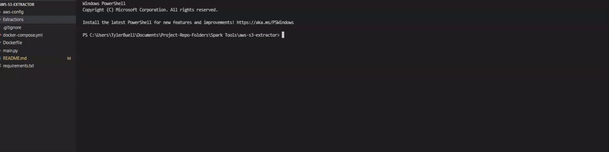

# AWS S3 Bucket Extractor

## Prerequisites

- Docker
- AWS Credentials (Access Key ID, Secret Access Key)

## Existing AWS CLI credentials
- If you have previously installed and configured AWS cli on your host, copy your configuration files (config & credentials) from `%UserProfile%/.aws` (windows) or `$HOME/.aws` (Linux) to the respective file in `aws-config`

## Quick Start
1. RUN `docker-compose run --rm s3-extract-cli`
2. Enter AWS cli configuration details (follow interactive prompts)
    - AWS Access Key ID
    - AWS Secret Access Key
    - Default region name (ex: us-east-1)
    - Default output format (ex: json)
3. Enter the target S3 URI address (ex: s3://bucket_name/subfolder) `NOTE: This can be copied to your clipboard on the AWS S3 Web Console`

## SubFolders
- The Extractor preserves the last subfolder in the path and extracts recursively
  so all files beneath the given bucket/subdirectory will be downloaded

## Extracting All Files From a Bucket
- To extract all files from a single s3 bucket use the following s3 URI syntax (ex: s3://bucket_name/*)
- Nested Subdirectory structure is not currently preserved
- *DISCLAIMER* - Downloading all files from a bucket is not recommended and can take a long time depending
                on how many objects and their sizes. I recommend isolating files into a subfolder and targeting that folder and any subfolder that fall beneath it.
## Output
- By default files will be downloaded into a normal directory in the `Extractions` folder
- Extractor will give the option to `compress` the folder to a `.zip` format

